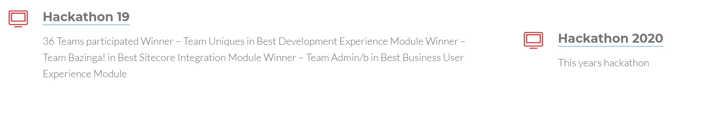
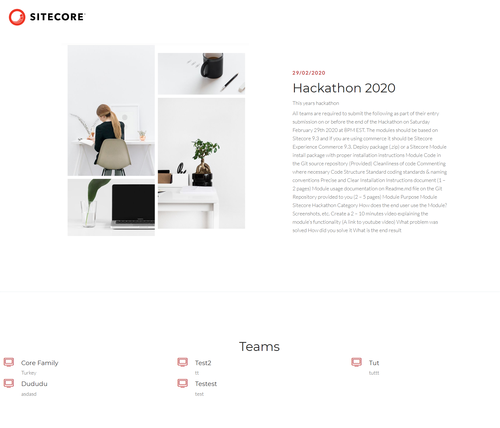

# Documentation

## Summary

**Category:** Sitecore Hackathon Website

Recreating existing Sitecore Hackathon page using Sitecore SXA

## Pre-requisites

- Sitecore SXA should be installed

## Installation

1. Use the Sitecore Installation wizard to install the [package](sc.package/LastPackage.zip)
2. Then, Publish Hackathon.Project.Website to the webroot
3. After that Sitecore site should be published to web as well.

We have 1 Project in our solution, it includes our frontend folder as well. It is required for styling SXA components
After that Sitecore site should be published to web as well.

## Configuration

We have included all of the required SXA Tenant and our custom templates to our package. So the package should create following items:
 1. master:/sitecore/content/Hackathon
 2. master:/sitecore/layout/Renderings/Project/Hackathon
 3. master:/sitecore/media library/Project/Hackathon
 4. master:/sitecore/media library/Themes/Hackathon
 5. master:/sitecore/templates/Project/Hackathon

## Usage
Site Features:

1. Home Page:

Home page has the following parts that can be managed in Experience Manager:

Jumbotron which includes A title, A youtube link, A description and Shows date of the upcoming Sitecore Hackathon.

- Upcoming Hackathon message:

Message section has a title, description, header and a message Image.

- Registration form:

This section has a message part and a custom form. Users should enter Name, Email and Country information. 

After the submit a new Team item is created and related to the upcoming event. But not published. To approve and show the team,
You should publish the team.

- Hackathon List:

Content managers can add multiple hackathons and assign one of them on the home page to enable it. All hackathons will be listed in this.

2. Hackathon detail page:

This page has the following parts:

Hackathon detail:

- Has Hackathon title, requirements and image.

- Teams:

Registered teams will be visible here after the publish. 

## Video

[Core Family](https://youtu.be/KznyIta9H-A) 
